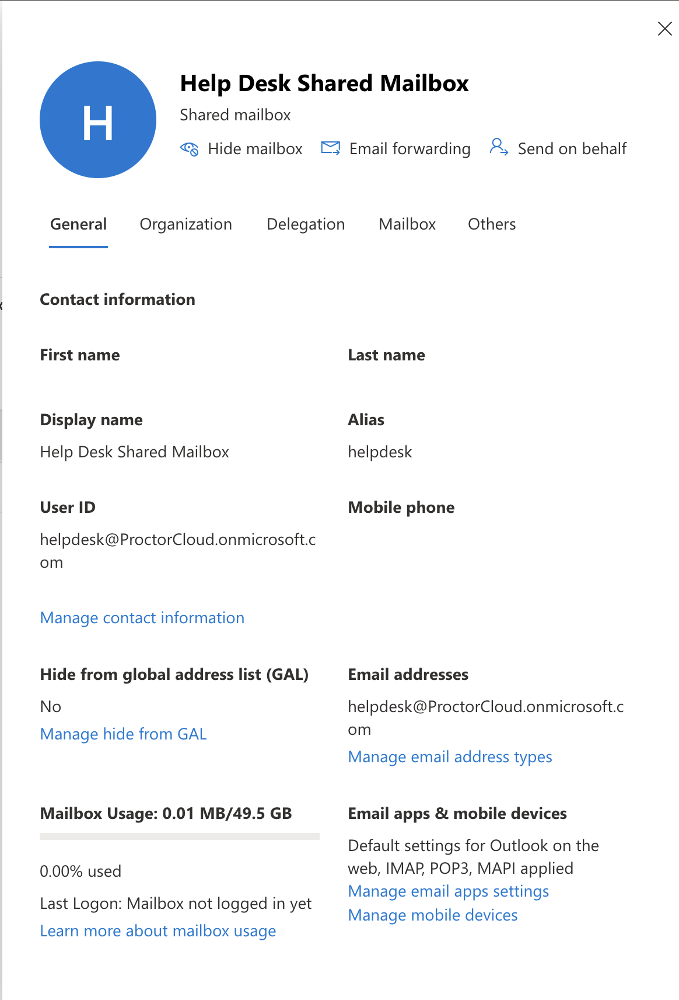
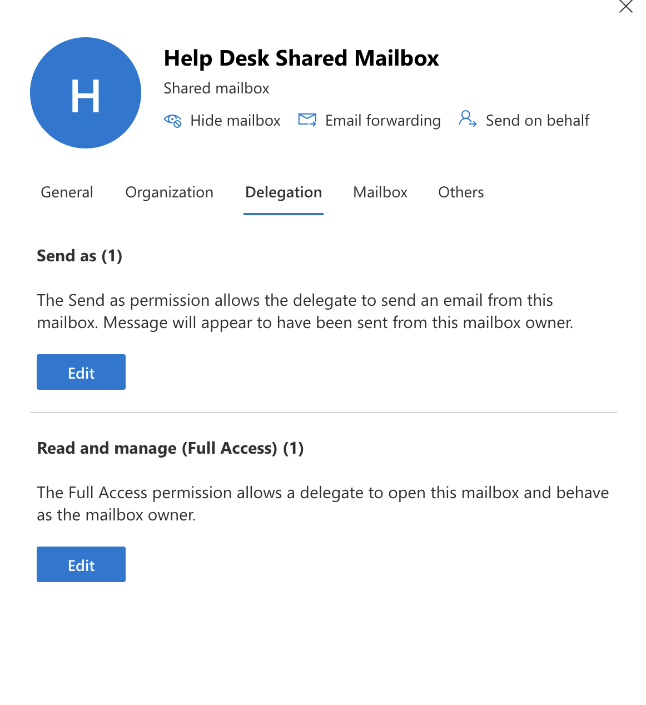
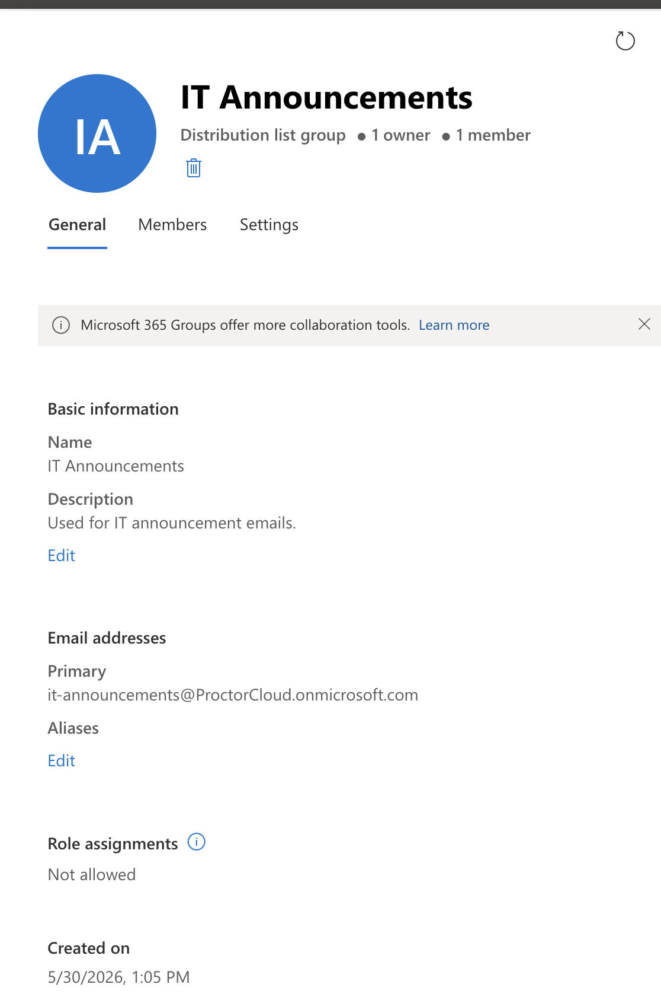
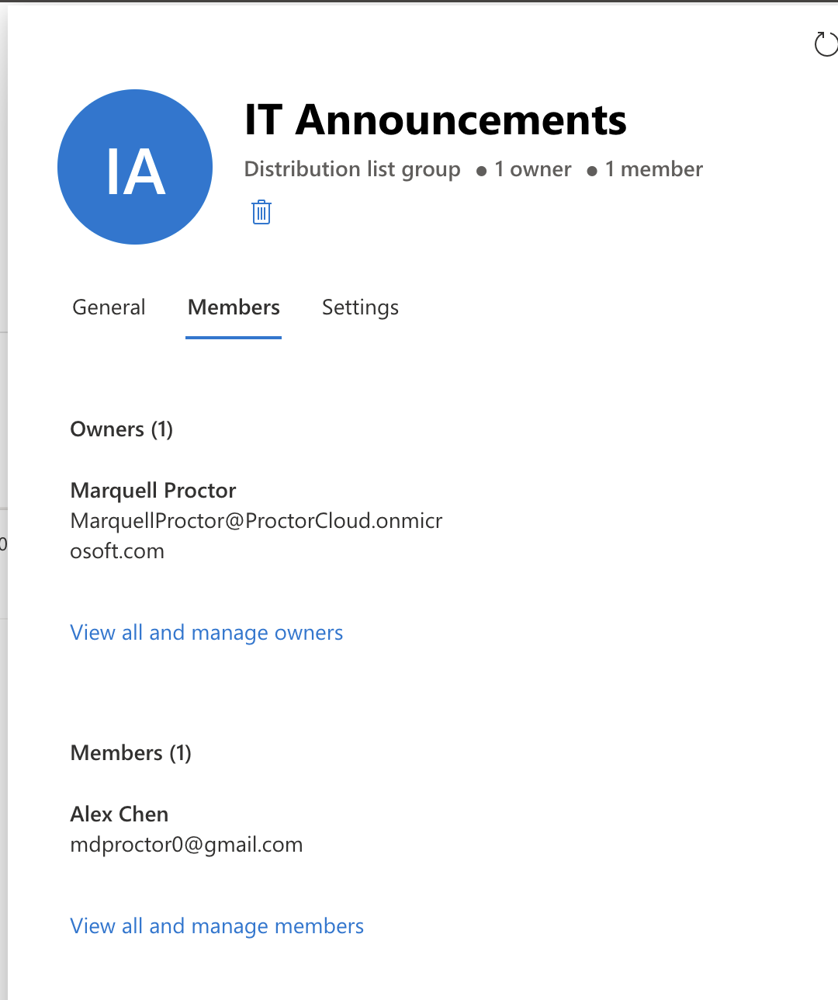
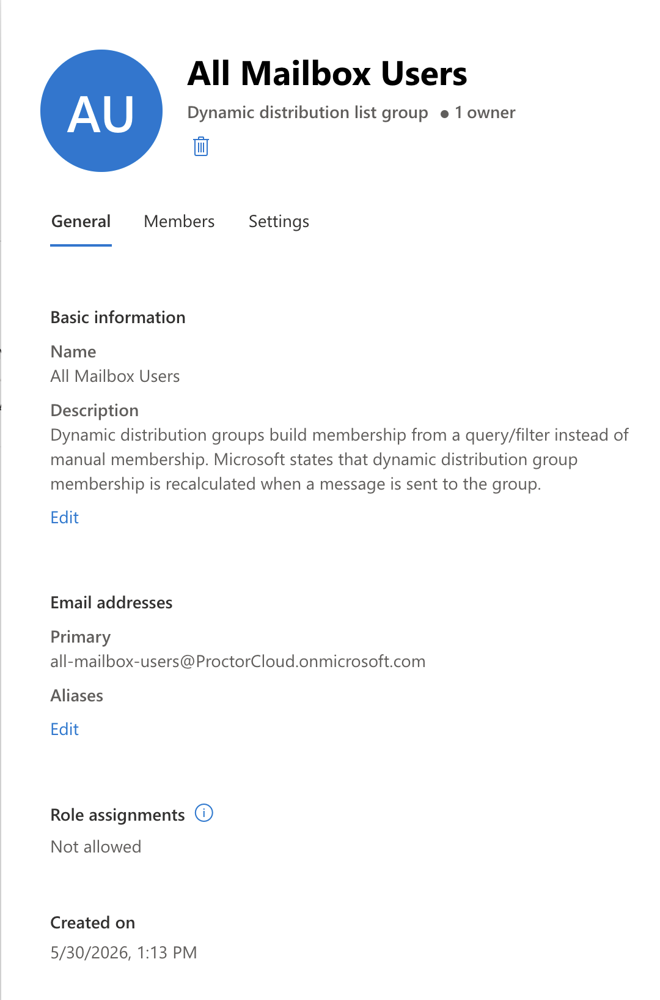
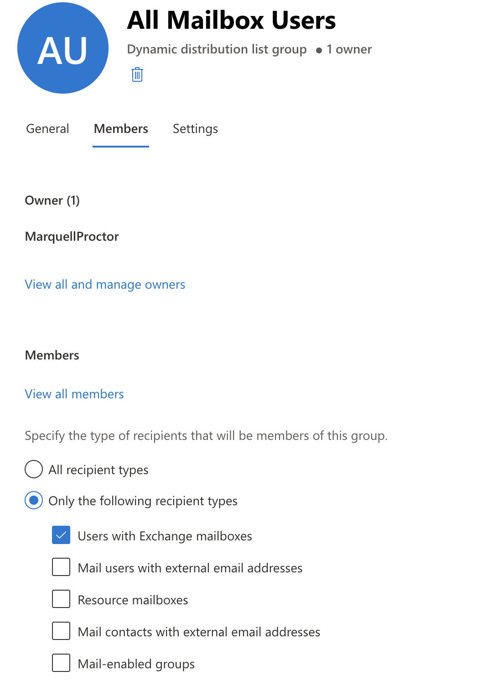
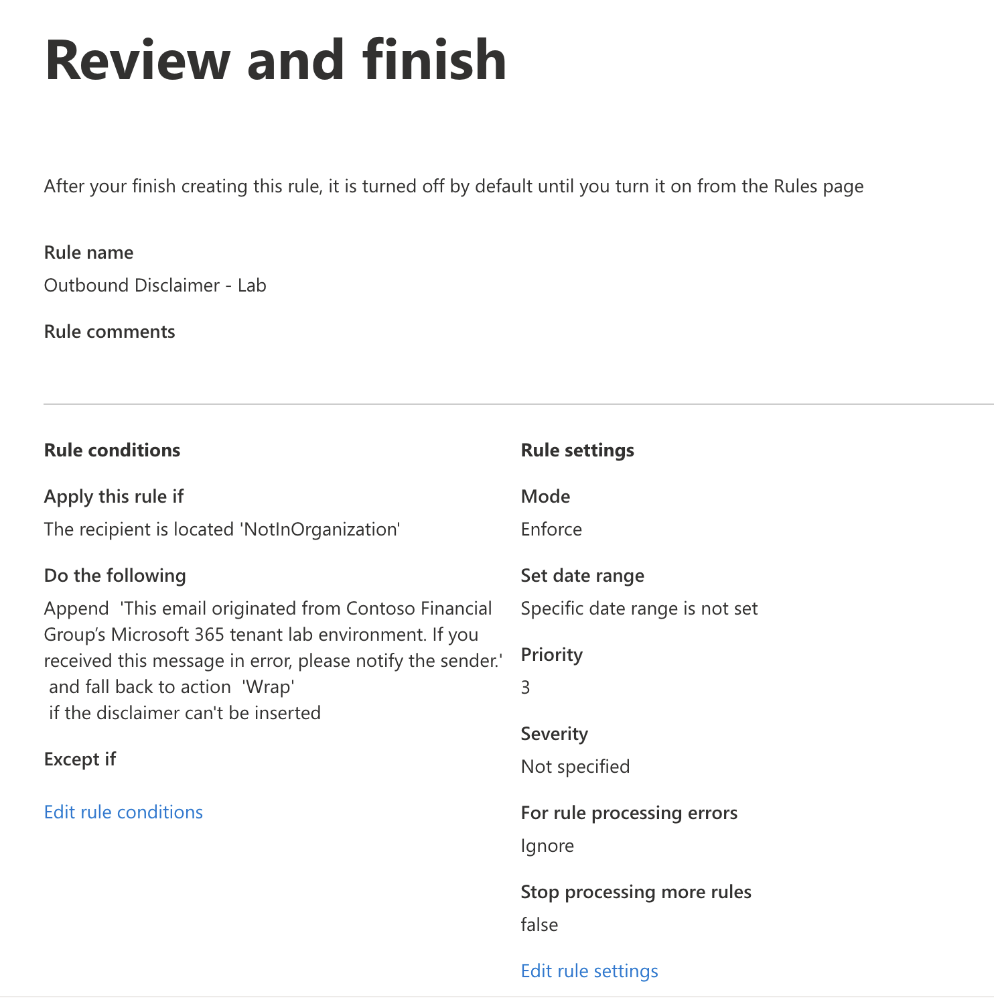
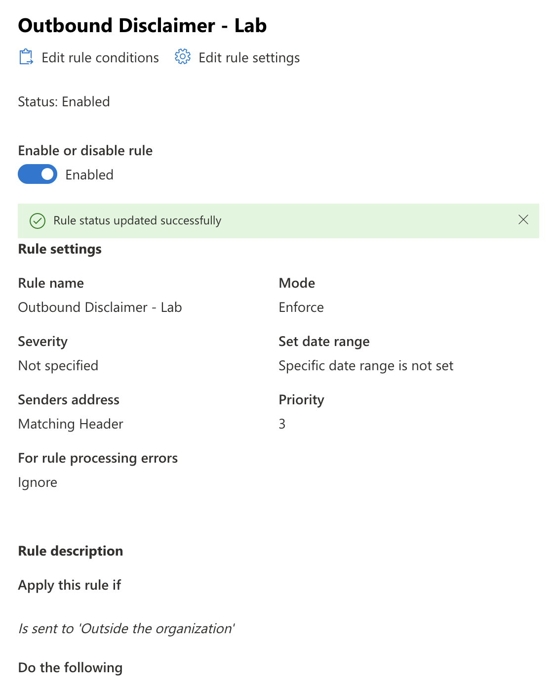

# Lab 01 — Exchange Online Administration

**Tenant:** ProctorCloud.onmicrosoft.com  
**Date Completed:** May 30, 2026  
**Tools:** Exchange Admin Center · Exchange Online PowerShell (`ExchangeOnlineManagement`)

---

## Objective

Build and manage core Exchange Online recipient objects and mail flow controls — the tasks an Exchange admin handles daily in a production M365 environment. Every object was created through the GUI first, then replicated via PowerShell to demonstrate both pathways.

---

## What Was Built

### 1. Shared Mailbox — Help Desk

A shared mailbox (`helpdesk@ProctorCloud.onmicrosoft.com`) for team-based email access where multiple users need to read and send from a common address.

**Delegation configured:**
- **Send As (1)** — delegate sends mail that appears to come from the shared mailbox address
- **Full Access (1)** — delegate can open and manage the mailbox as if they were the owner

> In production, shared mailboxes are common for support queues, HR inboxes, and team aliases where individual accountability isn't required but shared access is.




---

### 2. Distribution Group — IT Announcements

A standard distribution list (`it-announcements@ProctorCloud.onmicrosoft.com`) for broadcasting email to a static, manually managed list of members.

**Key properties:**
- Type: Distribution list group (not Microsoft 365 Group — no SharePoint/Teams attached)
- 1 owner (Marquell Proctor), 1 member (external contact: Alex Chen)
- External member included to reflect real-world scenarios (vendors, contractors)




---

### 3. Dynamic Distribution Group — All Mailbox Users

A dynamic distribution group (`all-mailbox-users@ProctorCloud.onmicrosoft.com`) whose membership is **not manually maintained** — it is recalculated at send time based on a recipient filter.

**Membership rule:** `Only the following recipient types → Users with Exchange mailboxes`

> This is the key distinction from a standard DL: you don't manage the member list. Exchange queries the filter each time a message is sent. Ideal for "all staff" groups where manual maintenance would be error-prone.




---

### 4. Transport Rule — Outbound Disclaimer

A mail flow transport rule (`Outbound Disclaimer - Lab`) that appends a disclaimer to all outbound email sent outside the organization.

**Rule logic:**
- **Condition:** Recipient is located `NotInOrganization`
- **Action:** Append HTML disclaimer text
- **Fallback:** `Wrap` — if disclaimer can't be inserted, wrap the original as an attachment
- **Mode:** Enforce (live, not audit)
- **Status:** Enabled

> The `Wrap` fallback is the production-safe choice. `Ignore` silently skips the disclaimer; `Reject` blocks the message. Wrap preserves delivery while maintaining compliance.




---

## PowerShell Replication

All objects above were also created and verified via Exchange Online PowerShell.

### Connect
```powershell
