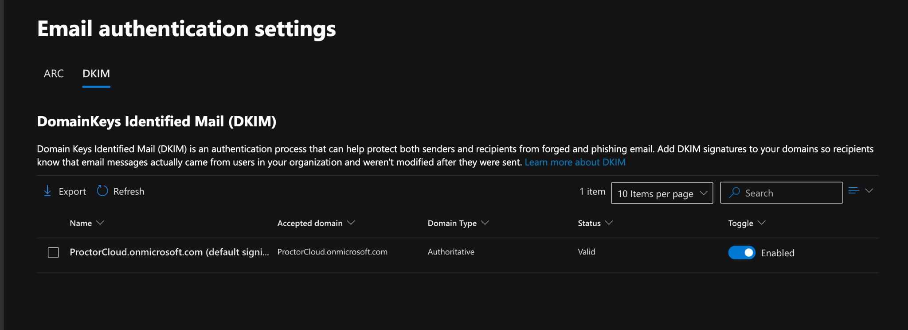
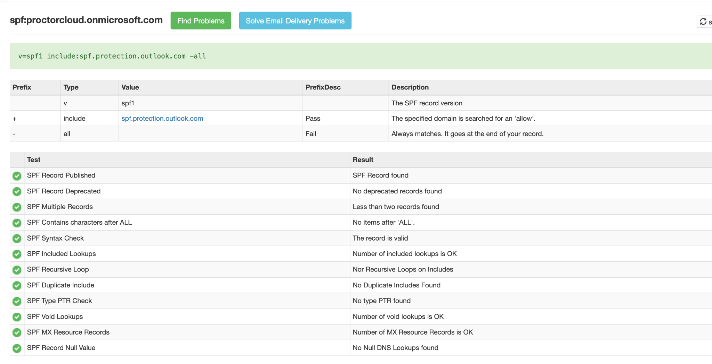
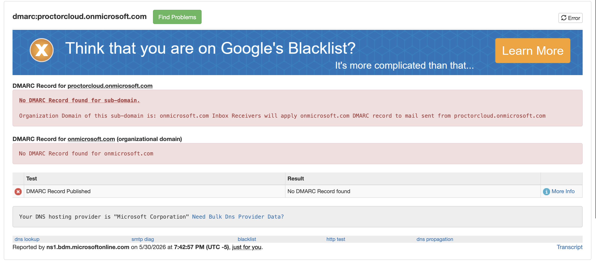

# Lab 02 — Email Authentication: SPF, DKIM, and DMARC

**Tenant:** ProctorCloud.onmicrosoft.com  
**Date Completed:** May 30, 2026  
**Tools:** Microsoft Defender Portal (security.microsoft.com) · MXToolbox · Exchange Online PowerShell

---

## Objective

Configure and validate the three-layer email authentication stack — SPF, DKIM, and DMARC — that protects an organization's email domain from spoofing and phishing. Understand how each layer works, how they interact, and how to deploy DMARC safely in a production environment.

---

## The Authentication Stack — How They Work Together

```
Sending Server
      │
      ▼
 SPF Check ──── Does this server IP appear in the domain's SPF record?
      │
      ▼
DKIM Check ──── Does this message carry a valid cryptographic signature?
      │
      ▼
DMARC Policy ── Do SPF/DKIM pass AND align with the From domain?
                If not → apply p=none / p=quarantine / p=reject
```

**The key word: alignment.**  
DMARC doesn't just require SPF or DKIM to pass — it requires the domain that passes to *match* the domain in the visible `From:` header. This is what closes the spoofing gap that SPF and DKIM alone can't close.

---

## Step 1 — DKIM: Enable Cryptographic Signing

**Where:** Microsoft Defender portal → Email & Collaboration → Policies & Rules → Threat Policies → Email Authentication Settings → DKIM

DKIM was enabled for `ProctorCloud.onmicrosoft.com`. Microsoft automatically manages the CNAME-based key rotation for `.onmicrosoft.com` domains — no manual DNS record creation required.

**Status confirmed:** Valid · Enabled · Authoritative domain type



**What this does:** Every outbound message now carries a `DKIM-Signature` header containing a cryptographic hash. Receiving mail servers look up the public key in DNS and verify the signature — confirming the message wasn't altered in transit and genuinely originated from this tenant.

> In production with a custom domain (e.g., `contoso.com`), you publish two CNAME records pointing to Microsoft's key infrastructure. Microsoft rotates the signing keys automatically.

---

## Step 2 — SPF: Analyze the Published Record

**Tool:** MXToolbox SPF Lookup → `proctorcloud.onmicrosoft.com`

**Record found:**
```
v=spf1 include:spf.protection.outlook.com -all
```

**Parse breakdown:**

| Token | Meaning |
|-------|---------|
| `v=spf1` | SPF version — required first token |
| `include:spf.protection.outlook.com` | Authorize all Microsoft Exchange Online sending IPs |
| `-all` | Hard fail — any IP not matched above fails SPF |

**Validation result:** 11/11 checks passed ✅



**Why `-all` vs `~all` matters:**  
`-all` (hard fail) tells receivers to reject mail from unauthorized IPs. `~all` (soft fail) only marks it suspicious. When all sending sources are known, `-all` is the stronger posture.

---

## Step 3 — DMARC: Architecture, Limitation, and Production Strategy

**Tool:** MXToolbox DMARC Lookup → `proctorcloud.onmicrosoft.com`

**Result:** No DMARC record found — expected and correct for this lab environment.



**Why no DMARC record exists — and why that's the right finding to document:**

`proctorcloud.onmicrosoft.com` is a Microsoft-managed subdomain. Microsoft controls the DNS zone for `onmicrosoft.com` — tenant administrators cannot publish custom TXT records there. This is a known architectural constraint of developer/sandbox tenants.

MXToolbox confirms this: receivers will apply the `onmicrosoft.com` parent domain DMARC policy by inheritance.

**In production with a custom domain, this is the record I would publish:**
```
_dmarc.contoso.com  TXT  "v=DMARC1; p=quarantine; rua=mailto:dmarc-reports@contoso.com; pct=100"
```

**Safe production deployment strategy:**

| Phase | Policy | Action |
|-------|--------|--------|
| 1 — Monitor | `p=none` | Collect aggregate reports, identify all sending sources, fix alignment issues |
| 2 — Quarantine | `p=quarantine` | Failed mail goes to junk, monitor for false positives |
| 3 — Reject | `p=reject` | Full enforcement — failed mail is rejected outright |

> Skipping Phase 1 is the most common and costly DMARC mistake. The `rua=` reporting address lets you see failures before enforcement affects users.

---

## Key Concepts Demonstrated

| Concept | Applied Here |
|---------|-------------|
| DKIM key management | Enabled via Defender portal; Microsoft manages CNAME-based key rotation |
| SPF `-all` vs `~all` | Hard fail chosen — stronger posture when all sending sources are known |
| DMARC alignment | From: domain must match the domain passing SPF/DKIM — closes the spoofing gap |
| Sandbox DNS limitation | Correctly identified why DMARC can't be published on `.onmicrosoft.com` |
| Safe DMARC rollout | p=none → p=quarantine → p=reject with aggregate reporting at each phase |
| `rua=` reporting | Aggregate reports sent to admin mailbox for monitoring alignment failures |
