# Lab 03 — Teams Governance & Policy Administration

**Tenant:** ProctorCloud.onmicrosoft.com  
**Date Completed:** June 1, 2026  
**Tools:** Teams Admin Center (admin.teams.microsoft.com) · Microsoft Teams PowerShell (`MicrosoftTeams`)

---

## Objective

Build and assign Teams governance policies that control how users schedule meetings, interact in chat, and share content — then replicate all configuration via PowerShell. Policy-based governance is how enterprise Teams environments enforce security, compliance, and acceptable-use standards without relying on individual user behavior.

---

## What Was Built

### 1. Meeting Policy — Lab-Restricted Meeting Policy

A custom Teams meeting policy with security-focused restrictions applied: anonymous access blocked, external participant controls removed, while keeping recording and transcription enabled for compliance.

**Key settings configured:**

**Meeting Scheduling & Lobby:**
- Private meeting scheduling: On
- Meet now (private + channel): Off — prevents ad-hoc unscheduled meetings
- Anonymous users can join unverified: Off
- Who can bypass the lobby: People in my org and guests only
- Who can admit from lobby: Organizers, co-organizers, and presenters only
- People dialing in can bypass lobby: Off
- People can join external meetings hosted by: Only people in trusted orgs

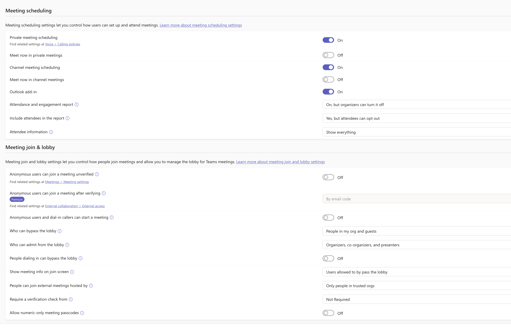

**Meeting Engagement & Content Sharing:**
- Meeting chat: On for everyone but anonymous users
- Who can present: Only organizers and co-organizers — reduces surface area for unauthorized screen sharing
- External participants can give or request control: Off
- Participant slide control: Everyone in my organization

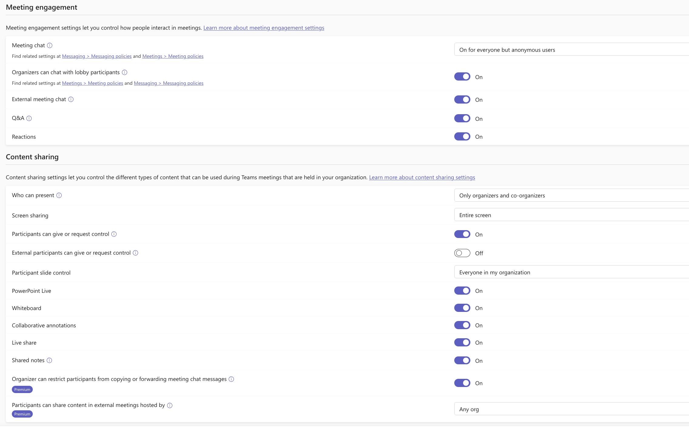

**Recording & Transcription:**
- Meeting recording: On
- Require participant agreement for recording/transcription: On — compliance-aware
- Transcription: On
- Recordings and transcriptions automatically expire: On — 120 day default
- Copilot: On with saved transcript required

> In a regulated environment like financial services or federal government, requiring participant agreement before recording starts is a compliance and legal requirement, not just a courtesy.

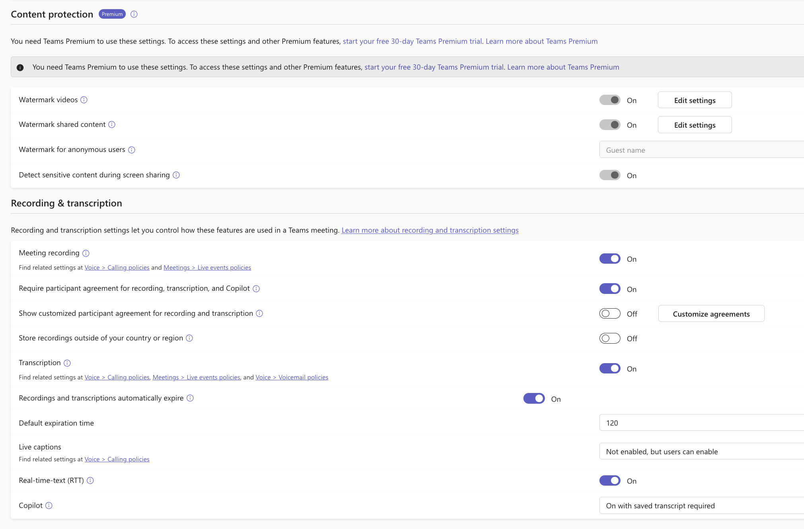

**Audio & Video:**
- Mode for IP audio/video: Outgoing and incoming enabled
- Video conferencing: On
- Media bit rate: 50,000 Kbps
- Live streaming: Off

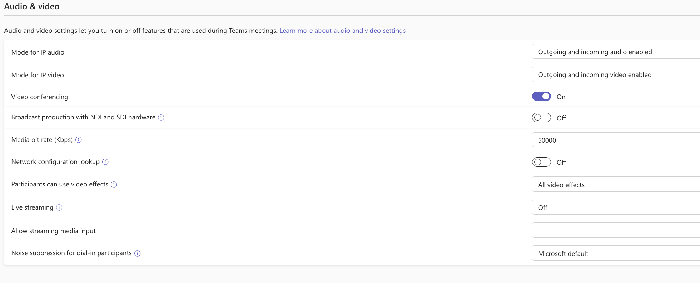

---

### 2. Messaging Policy — Lab-Controlled Messaging Policy

A custom messaging policy that locks down non-business content features while preserving core communication functionality.

**Key settings configured:**
- Owners can delete sent messages: Off
- Users can delete sent messages: Off
- Edit sent messages: Off — immutability for compliance
- Giphy in conversations: Off
- Memes in conversations: Off
- Stickers in conversations: Off
- Chat permission role: Restricted permissions
- URL previews: On — retained for productivity
- Report inappropriate content: On
- Report a security concern: On
- Priority notifications: On

> Disabling message deletion and editing preserves chat as an audit trail — critical in regulated environments where Teams messages may be subject to eDiscovery or records retention requirements.

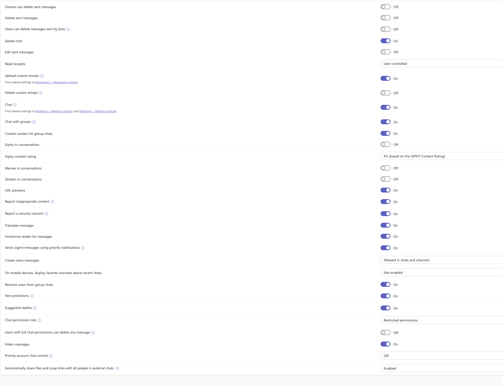

---

### 3. Policy Assignment — Direct User Assignment

Both policies were assigned directly to Marquell Proctor (`MarquellProctor@ProctorCloud.onmicrosoft.com`) via the Teams Admin Center user profile → Policies tab.

**Confirmed assignments:**
- Meeting policy: `Lab - Restricted Meeting Policy` — Direct assignment
- Messaging policy: `Lab - Controlled Messaging Policy` — Direct assignment

> Direct assignment overrides any group-based or global policy for that user. In production you'd use group policy assignment for scale — assigning to an Entra ID security group rather than individual users — but direct assignment is used here to demonstrate and verify the specific policy taking effect.

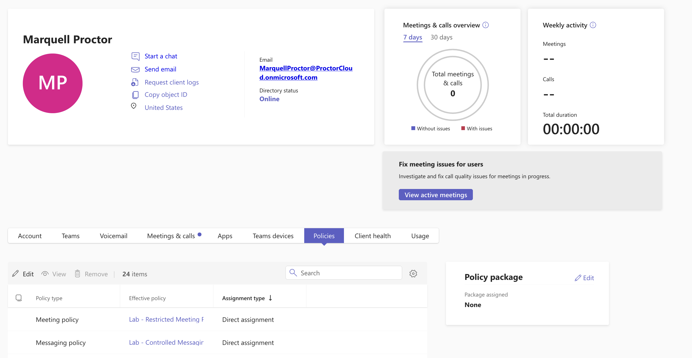

---

## PowerShell Replication

### Connect to Teams PowerShell
```powershell
Connect-MicrosoftTeams -UseDeviceAuthentication
Get-CsTenant | Select-Object DisplayName, TenantId
```

Device authentication used — browser-based MFA flow, modern auth. `Get-CsTenant` confirms the correct tenant is connected before making any changes.

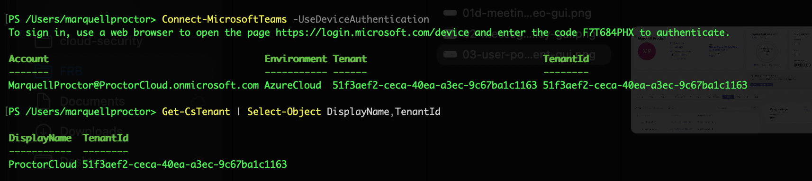

---

### Create meeting policy via PowerShell
```powershell
New-CsTeamsMeetingPolicy `
  -Identity "Lab-Restricted-Meeting-Policy-PS" `
  -Description "Lab policy restricting anonymous access and external control for Teams meetings." `
  -AllowMeetNow $false `
  -AllowPrivateMeetNow $false `
  -AllowAnonymousUsersToJoinMeeting $false `
  -AllowExternalParticipantGiveRequestControl $false `
  -AllowCloudRecording $true `
  -AllowTranscription $true

Get-CsTeamsMeetingPolicy -Identity "Lab-Restricted-Meeting-Policy-PS" | `
  Select-Object Identity, AllowMeetNow, AllowPrivateMeetNow, `
    AllowAnonymousUsersToJoinMeeting, `
    AllowExternalParticipantGiveRequestControl, `
    AllowCloudRecording, AllowTranscription
```

**Verified output:**
- AllowMeetNow: False
- AllowPrivateMeetNow: False
- AllowAnonymousUsersToJoinMeeting: False
- AllowExternalParticipantGiveRequestControl: False
- AllowCloudRecording: True
- AllowTranscription: True

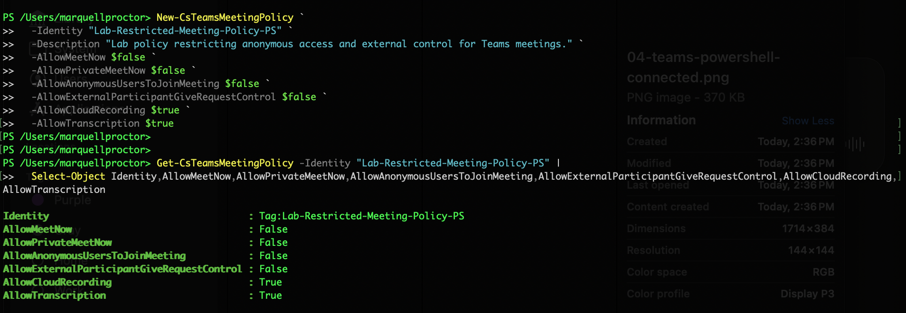

---

### Create messaging policy via PowerShell
```powershell
New-CsTeamsMessagingPolicy `
  -Identity "Lab-Controlled-Messaging-Policy-PS" `
  -Description "Lab policy controlling message deletion, editing, and non-business content features." `
  -AllowUserDeleteMessage $false `
  -AllowUserEditMessage $false `
  -AllowOwnerDeleteMessage $false `
  -AllowGiphy $false `
  -AllowMemes $false `
  -AllowStickers $false `
  -AllowUrlPreviews $true

Get-CsTeamsMessagingPolicy -Identity "Lab-Controlled-Messaging-Policy-PS" | `
  Select-Object Identity, AllowUserDeleteMessage, AllowUserEditMessage, `
    AllowOwnerDeleteMessage, AllowGiphy, AllowMemes, AllowStickers, AllowUrlPreviews
```

**Verified output:**
- AllowUserDeleteMessage: False
- AllowUserEditMessage: False
- AllowOwnerDeleteMessage: False
- AllowGiphy / AllowMemes / AllowStickers: False
- AllowUrlPreviews: True

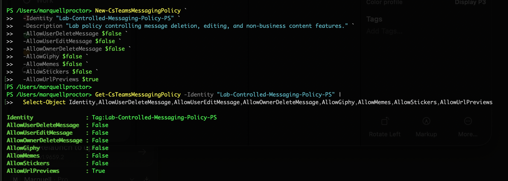

---

### Assign both policies to user and verify
```powershell
$User = "MarquellProctor@ProctorCloud.onmicrosoft.com"

Grant-CsTeamsMeetingPolicy `
  -Identity $User `
  -PolicyName "Lab-Restricted-Meeting-Policy-PS"

Grant-CsTeamsMessagingPolicy `
  -Identity $User `
  -PolicyName "Lab-Controlled-Messaging-Policy-PS"

Get-CsOnlineUser -Identity $User | `
  Select-Object DisplayName, UserPrincipalName, TeamsMeetingPolicy, TeamsMessagingPolicy
```

**Verified output:**
- TeamsMeetingPolicy: Lab-Restricted-Meeting-Policy-PS
- TeamsMessagingPolicy: Lab-Controlled-Messaging-Policy-PS

Both policies confirmed as direct assignments on the user object.

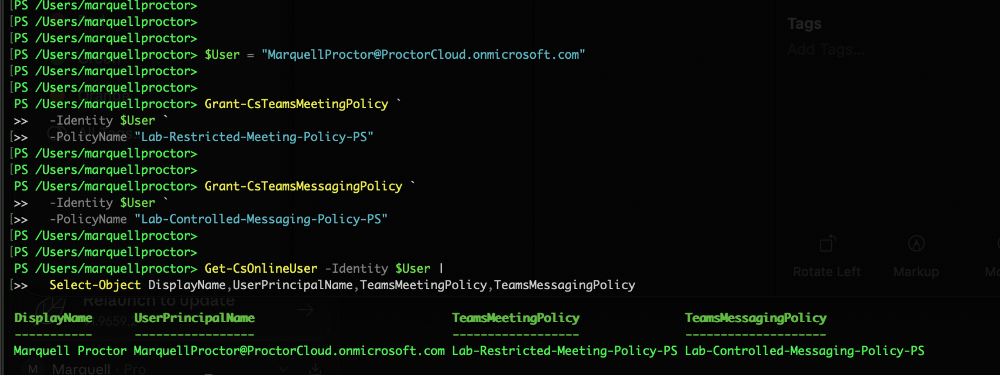

---

## Key Concepts Demonstrated

| Concept | Applied Here |
|---------|-------------|
| Meeting lobby control | Who can bypass and who can admit — reduces unauthorized join risk |
| Anonymous access restriction | Blocked at policy level — not reliant on organizer settings |
| Recording compliance | Participant agreement required before recording starts |
| Message immutability | Delete and edit disabled — preserves Teams chat as audit trail |
| Non-business content controls | Giphy/memes/stickers disabled — enforces professional communication standard |
| Direct vs group policy assignment | Direct assignment used for verification; group assignment is production scale approach |
| Policy verification via PowerShell | `Get-CsOnlineUser` confirms effective policy on the user object — not just that policy exists |

---

### 4. App Permission Policy — Sandbox Limitations Documented

**Attempted:** Create an app permission policy to block specific third-party apps.

**What was found across three layers:**

| Layer | Finding |
|-------|---------|
| Teams Admin Center — Permission Policies | Deprecated. Microsoft has redirected app control to Manage apps. |
| Teams Admin Center — Manage apps | App catalog empty in E5 developer sandbox — no apps available to block. |
| PowerShell — `New-CsTeamsAppPermissionPolicy` | Parameter types changed — `-DefaultCatalogApps` no longer accepts plain strings. Simplified syntax succeeded. |

**What was accomplished:** Policy created and assigned via PowerShell using corrected syntax. Confirmed on user object via `Get-CsOnlineUser`.

```powershell
New-CsTeamsAppPermissionPolicy `
  -Identity "Lab-Restricted-App-Permission-Policy-PS" `
  -Description "App permission policy created via PowerShell - GUI deprecated in favor of Manage apps."

Grant-CsTeamsAppPermissionPolicy `
  -Identity $User `
  -PolicyName "Lab-Restricted-App-Permission-Policy-PS"

Get-CsOnlineUser -Identity $User | `
  Select-Object DisplayName, TeamsAppPermissionPolicy
```


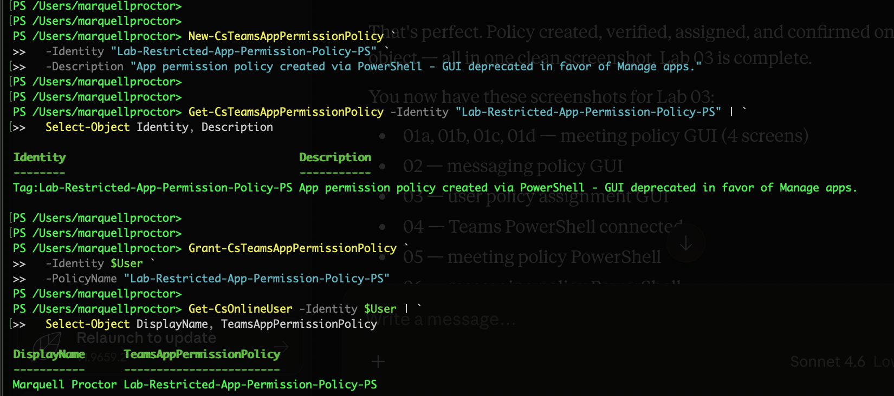

> App governance in Teams is actively mid-migration. The permission policy model is being deprecated, the Manage apps replacement isn't fully functional in sandbox tenants, and the PowerShell layer has breaking parameter changes. Documenting this accurately reflects real-world M365 administration — the portal changes faster than the PowerShell layer, and knowing which layer to trust is part of the job.


