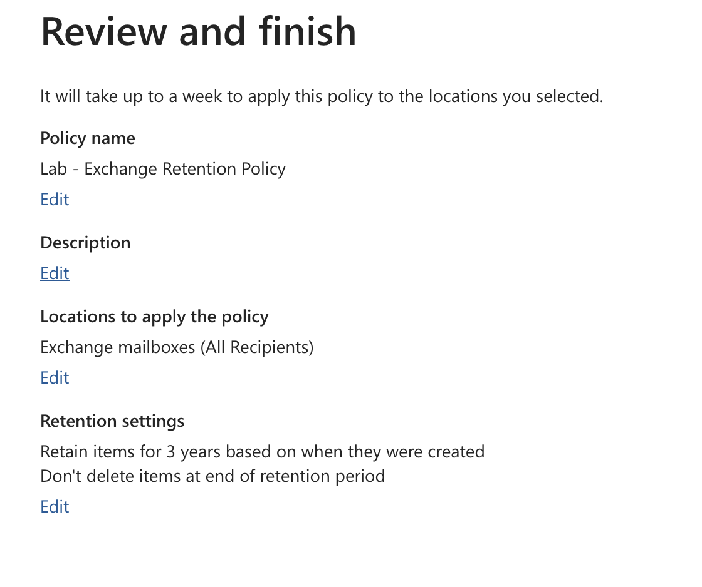
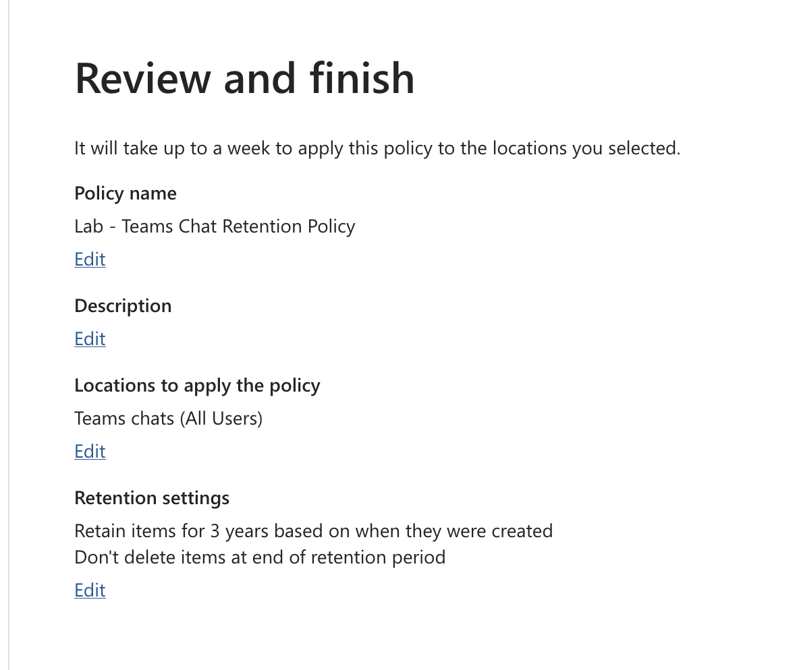
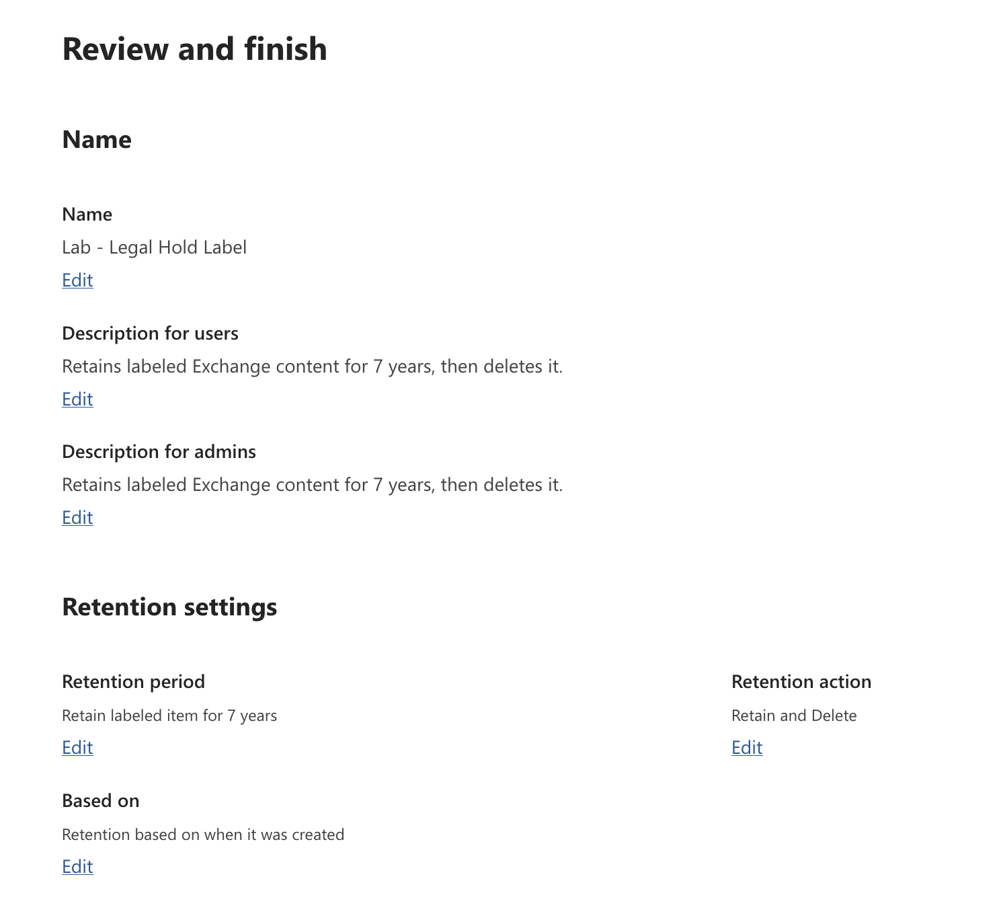
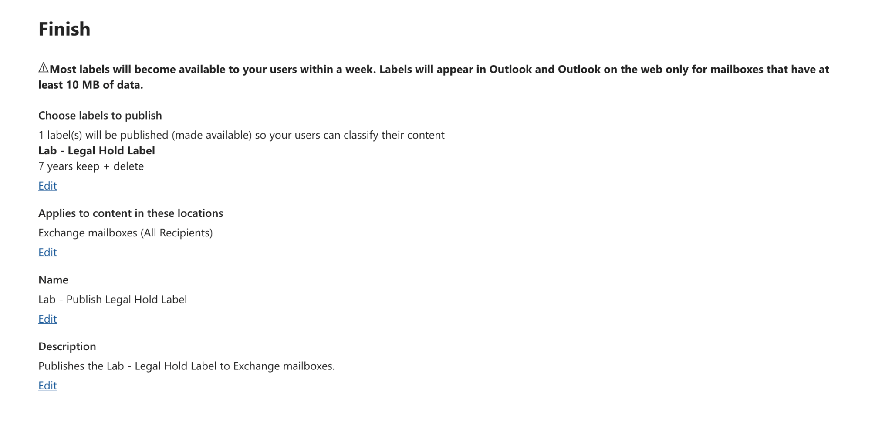
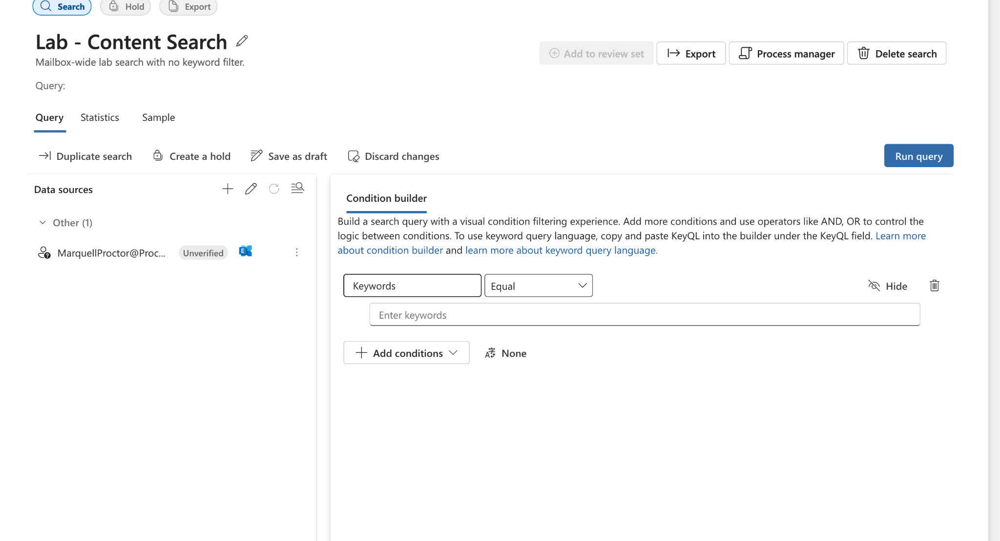
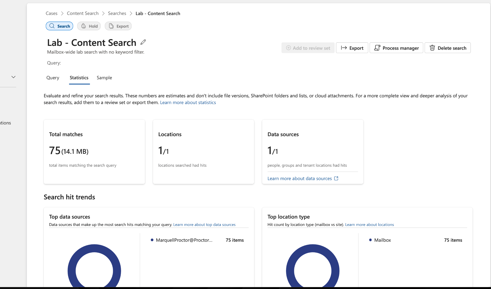
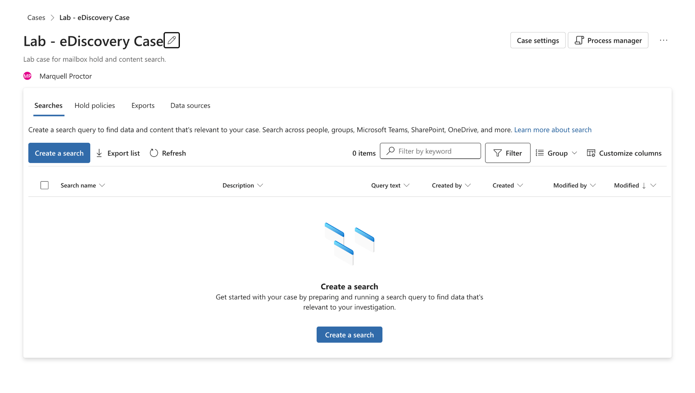
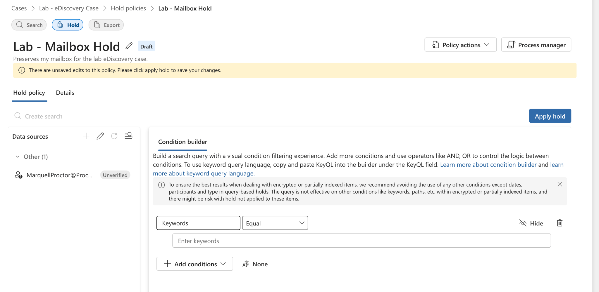
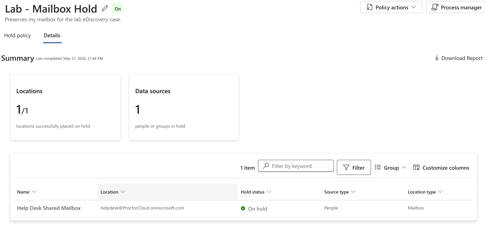
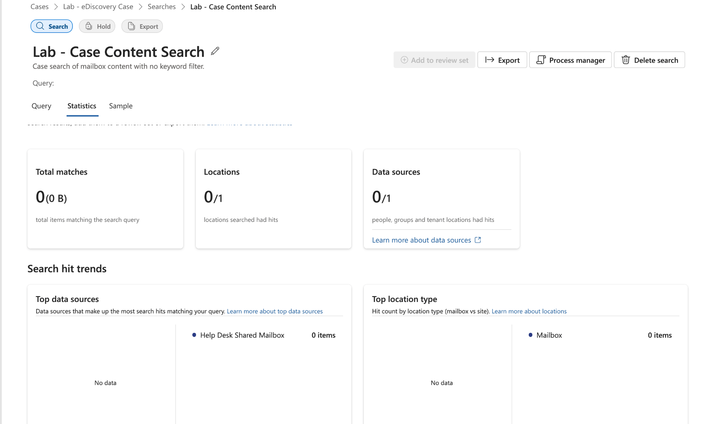

# Lab 04 — Purview Compliance: eDiscovery & Retention

**Tenant:** ProctorCloud.onmicrosoft.com  
**Date Completed:** May 31, 2026  
**Tools:** Microsoft Purview Compliance Portal (compliance.microsoft.com)

---

## Objective

Configure Microsoft Purview retention policies, retention labels, and eDiscovery to demonstrate how an organization preserves, classifies, and searches content for compliance and legal purposes. This is core daily work in regulated environments — the Federal Reserve, like all financial regulators, operates under strict records retention and legal hold requirements.

---

## What Was Built

### 1. Retention Policy — Exchange Mailboxes

**Policy name:** Lab - Exchange Retention Policy  
**Location:** Exchange mailboxes (All Recipients)  
**Retention settings:** Retain items for 3 years based on when created — do not delete at end of period

> Retention policies apply automatically at the workload level — no user action required. Exchange and Teams are separate workloads and require separate policies. "Don't delete at end of period" is the conservative choice for compliance: preserve, then let records management decide disposition separately.

---

### 2. Retention Policy — Teams Chats

**Policy name:** Lab - Teams Chat Retention Policy  
**Location:** Teams chats (All Users)  
**Retention settings:** Retain items for 3 years based on when created — do not delete at end of period

> Teams chat messages are stored in hidden Exchange mailbox folders — but they require their own retention policy scoped to the Teams workload, not the Exchange policy. A common mistake is assuming the Exchange retention policy covers Teams. It does not.

---

### 3. Retention Label — Legal Hold Label

**Label name:** Lab - Legal Hold Label  
**Retention period:** 7 years  
**Retention action:** Retain and Delete  
**Based on:** When item was created

**Difference from retention policy:**

| | Retention Policy | Retention Label |
|--|-----------------|-----------------|
| Application | Automatic, workload-wide | Manual by user or auto-apply rule |
| Granularity | Applies to all content in location | Applies to specific items |
| Use case | Org-wide baseline retention | Item-level classification (legal hold, sensitive records) |
| Action | Retain or delete | Retain and delete (more precise) |

> Retention labels give users the ability to classify individual items — or admins can auto-apply them based on sensitive content types or keywords. The "Retain and Delete" action means content is preserved for 7 years and then permanently deleted — appropriate for legal hold scenarios with a defined disposition.

---

### 4. Label Publish Policy — Lab - Publish Legal Hold Label

The retention label was published to Exchange mailboxes (All Recipients) via a label policy, making it available to users in Outlook for manual application.

**Publish policy name:** Lab - Publish Legal Hold Label  
**Label published:** Lab - Legal Hold Label (7 years keep + delete)  
**Locations:** Exchange mailboxes (All Recipients)

> Labels must be published before users can apply them. Labels appear in Outlook on the web only for mailboxes with at least 10 MB of data — a sandbox limitation noted in the portal itself. In production, auto-apply policies can apply labels automatically based on sensitive info types, keywords, or trainable classifiers — removing the dependency on user action.

---

### 5. Content Search — Lab - Content Search

A mailbox-wide content search with no keyword filter, returning all indexable content from the custodian mailbox.

**Search name:** Lab - Content Search  
**Description:** Mailbox-wide lab search with no keyword filter  
**Data source:** MarquellProctor@ProctorCloud.onmicrosoft.com  
**Results:** 75 items · 14.1 MB · 1/1 locations with hits

> Content Search is the fastest way to scope and size a collection before deciding whether to open a formal eDiscovery case. In production, you'd run a keyword-scoped search first (date range + custodians + keywords), review statistics, then refine before placing a hold or exporting. Running without a keyword filter returns everything — useful for a broad custodian inventory.

---

### 6. eDiscovery Case — Lab - eDiscovery Case

A standard eDiscovery case created to manage a simulated legal hold and content search within a formal case structure.

**Case name:** Lab - eDiscovery Case  
**Description:** Lab case for mailbox hold and content search  
**Case member:** Marquell Proctor

---

### 7. Mailbox Hold — Lab - Mailbox Hold

A hold policy placed on the Help Desk Shared Mailbox within the eDiscovery case, preserving all content regardless of user deletion.

**Hold name:** Lab - Mailbox Hold  
**Custodian:** helpdesk@ProctorCloud.onmicrosoft.com (Help Desk Shared Mailbox)  
**Hold status:** ✅ On  
**Locations successfully placed on hold:** 1/1

> A hold preserves content in-place — the user can still access their mailbox normally, but anything they delete goes to the Recoverable Items folder and is retained. The hold is invisible to the end user. This is how legal teams ensure evidence isn't destroyed while an investigation is ongoing.

---

### 8. Case Content Search — Lab - Case Content Search

A content search run within the eDiscovery case, scoped to the Help Desk Shared Mailbox (the held custodian).

**Results:** 0 items — expected and correct.

The Help Desk Shared Mailbox was created in Lab 01 and has never received mail. Zero results confirms the search is functioning correctly — the mailbox is on hold and searchable, it simply contains no content yet.

> In production, case searches are scoped to specific custodians and date ranges relevant to the legal matter. Results are reviewed, then exported or added to a review set. eDiscovery Premium adds AI-assisted review, near-duplicate detection, and custodian management on top of Standard.

---

## eDiscovery Tier Comparison

| Feature | Content Search | eDiscovery Standard | eDiscovery Premium |
|---------|---------------|--------------------|--------------------|
| Search across M365 | ✅ | ✅ | ✅ |
| Place holds | ❌ | ✅ | ✅ |
| Case management | ❌ | ✅ | ✅ |
| Review sets | ❌ | ❌ | ✅ |
| AI-assisted review | ❌ | ❌ | ✅ |
| Custodian management | ❌ | ❌ | ✅ |

> Start with Content Search to scope. Use Standard for holds and case management. Use Premium for large, complex litigation with review workflows.

---

## Key Concepts Demonstrated

| Concept | Applied Here |
|---------|-------------|
| Retention policy vs retention label | Policy = automatic, workload-wide; Label = item-level, manual or auto-apply |
| Exchange vs Teams retention separation | Separate policies required — Exchange policy does not cover Teams chats |
| Retain vs Retain and Delete | Policy retains without deleting; Label retains then deletes at 7 years |
| Label publish policy | Two-step: create label → publish via policy before users can apply |
| Content Search scoping | No-filter search returns full mailbox inventory — useful for custodian sizing |
| eDiscovery hold | Preserves content in-place, invisible to user, survives deletion attempts |
| 0-result case search | Correctly documented — mailbox on hold and searchable, no content yet |
| Standard vs Premium eDiscovery | Standard used here; Premium adds review sets, AI, custodian workflows |
