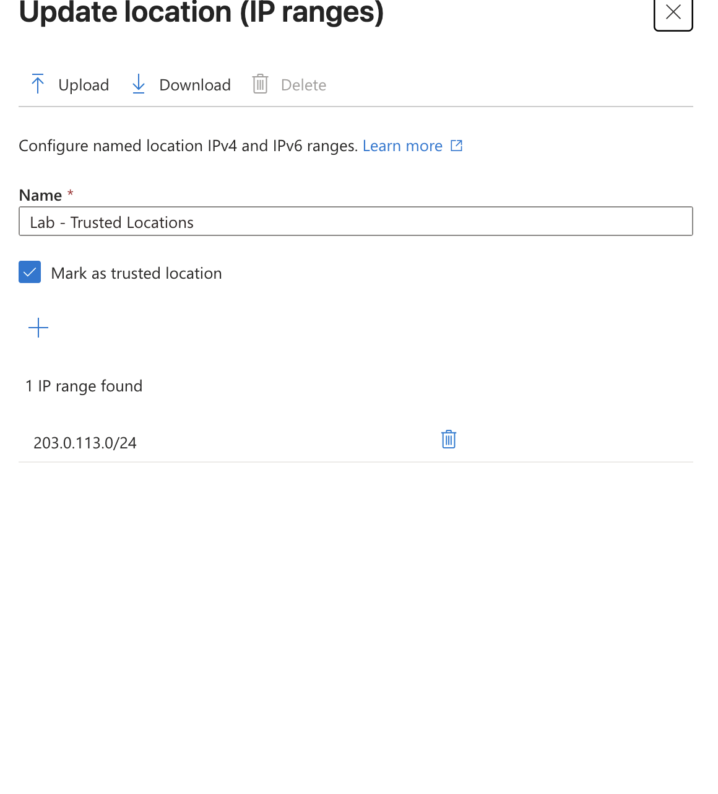
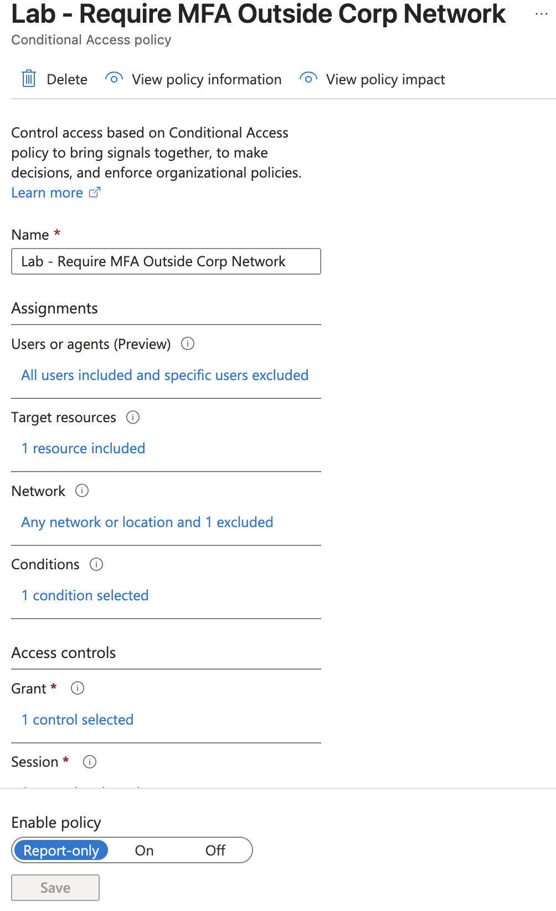
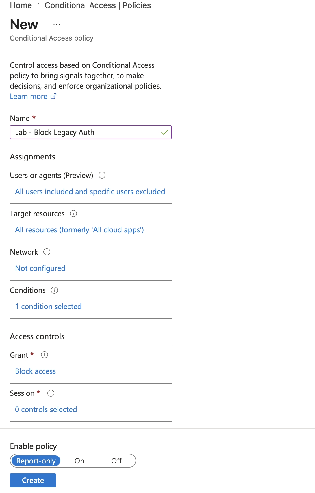
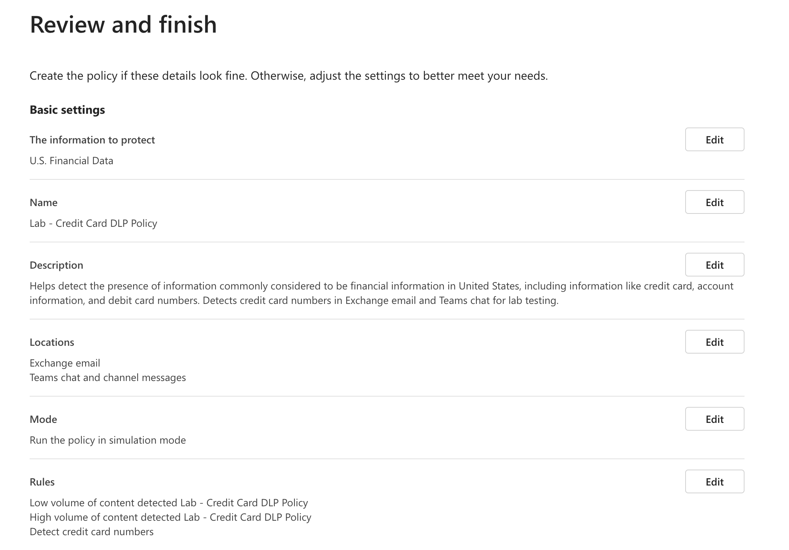

# Lab 05 — Conditional Access & Data Loss Prevention

**Tenant:** ProctorCloud.onmicrosoft.com  
**Date Completed:** June 1, 2026  
**Tools:** Microsoft Entra ID (entra.microsoft.com) · Microsoft Purview Compliance Portal (compliance.microsoft.com)

---

## Objective

This lab bridges existing Azure/Entra identity security skills directly into the M365 environment. Conditional Access and DLP are the two primary controls that protect data in motion — Conditional Access governs who can access M365 workloads and under what conditions, while DLP governs what sensitive data can be shared across those workloads. Both run on the same Entra ID and Purview infrastructure that underlies all M365 security.

---

## What Was Built

### 1. Named Location — Lab - Trusted Locations

Before building location-aware Conditional Access policies, a named location was created to represent a trusted corporate network.

**Configuration:**
- Name: Lab - Trusted Locations
- Marked as trusted location: ✅
- IP range: `203.0.113.0/24` (RFC 5737 documentation range — safe for lab use)



> Named locations are the reference objects that Conditional Access policies use for location-based conditions. In production, you'd define your corporate egress IPs or use the "compliant network" condition tied to Global Secure Access. The RFC 5737 range (`203.0.113.0/24`) is reserved for documentation — it will never match real traffic, making it safe to use as a lab reference without accidentally affecting production sign-ins.

---

### 2. Conditional Access Policy — Require MFA Outside Corp Network

**Policy name:** Lab - Require MFA Outside Corp Network  
**State:** Report-only

**Policy logic:**
- **Users:** All users included, specific users excluded (break-glass account excluded — best practice)
- **Target resources:** 1 resource included (Office 365)
- **Network:** Any network or location — exclude Lab - Trusted Locations
- **Conditions:** 1 condition selected
- **Grant:** 1 control selected (Require MFA)



**What this policy does:** Any user accessing Office 365 from an IP outside the trusted corporate network range must complete MFA. Users on the corporate network are excluded — reducing MFA fatigue for on-site staff while maintaining strong authentication for remote access.

> **Why Report-only and not On?** In a sandbox with a single admin account, enabling a policy that could block or challenge your own access risks locking yourself out. Report-only mode evaluates the policy against real sign-ins and logs what *would* have happened — giving you the data to validate the policy is correct before enforcement. This is also the Microsoft-recommended approach for production: always test in Report-only first.

---

### 3. Conditional Access Policy — Block Legacy Authentication

**Policy name:** Lab - Block Legacy Auth  
**State:** Report-only

**Policy logic:**
- **Users:** All users included, specific users excluded
- **Target resources:** All resources (formerly 'All cloud apps')
- **Conditions:** 1 condition selected (client apps — legacy auth clients)
- **Grant:** Block access



**What this policy does:** Blocks any authentication attempt using legacy protocols — Exchange ActiveSync with basic auth, older MAPI clients, SMTP AUTH, POP3/IMAP with passwords. Legacy auth clients cannot perform MFA challenges, making them a persistent attack vector for password spray and credential stuffing attacks.

> Blocking legacy auth is one of the highest-impact single security controls in M365. Microsoft reports that legacy authentication is involved in the majority of account compromise incidents. Scoping to "All resources" ensures no legacy client can bypass the block by targeting a less-protected app. This policy pairs directly with the MFA policy — together they ensure all access is both MFA-capable and location-aware.

---

### Conditional Access — The Signal/Decision/Enforcement Model

```
Signal (Who/What/Where/When)
  │  User risk, device compliance,
  │  location, client app, sign-in risk
  ▼
Decision Engine (Entra ID)
  │  Evaluates all matching policies
  │  Most restrictive policy wins
  ▼
Enforcement (Grant/Block/Session)
     Require MFA, require compliant device,
     block access, limit session
```

> Conditional Access evaluates signals at authentication time — not at provisioning time. Every sign-in is evaluated against all applicable policies. This is the zero-trust "verify explicitly" principle in practice.

---

### 4. DLP Policy — Lab - Credit Card DLP Policy

**Policy name:** Lab - Credit Card DLP Policy  
**Template:** U.S. Financial Data  
**Mode:** Simulation (test mode)

**Configuration:**
- **Information to protect:** U.S. Financial Data (credit card numbers, account numbers, debit card numbers)
- **Locations:** Exchange email + Teams chat and channel messages
- **Mode:** Run the policy in simulation mode

**Rules configured:**

| Rule | Trigger | Action |
|------|---------|--------|
| Low volume of content detected | Small number of credit card instances | Notify user, generate alert |
| High volume of content detected | Large number of credit card instances | Notify user, restrict sharing, generate alert |
| Detect credit card numbers | Any credit card number detected | Core detection rule |



**Why simulation mode first:**

Starting in simulation mode is the correct production approach. DLP policies match on sensitive information type patterns — and those patterns can produce false positives. A policy that fires on legitimate business content (sales orders with account numbers, invoices, expense reports) erodes user trust and generates helpdesk tickets before you've had a chance to tune it.

**Safe DLP rollout:**

```
Phase 1 — Simulation
  Policy runs but takes no action.
  Review DLP activity reports to see what would have matched.
  Identify false positives and tune rule thresholds.

Phase 2 — Notify only (no block)
  Policy notifies users and admins but doesn't block.
  Users can override with a business justification.
  Builds awareness without disrupting workflow.

Phase 3 — Enforce
  Policy blocks sharing of matched content.
  High-confidence matches blocked automatically.
  Audit trail maintained for compliance reporting.
```

> The two-threshold rule design (low volume / high volume) is intentional. Low-volume matches might be legitimate — a salesperson quoting pricing. High-volume matches almost certainly indicate a data exfiltration attempt or accidental bulk exposure. Different thresholds allow different responses proportional to the risk.

---

## How Conditional Access and DLP Work Together

These two controls operate at different layers but are complementary:

| Control | Layer | Protects Against |
|---------|-------|-----------------|
| Conditional Access | Authentication | Unauthorized access — wrong user, wrong location, wrong device |
| DLP | Data in motion | Unauthorized sharing — right user, but sharing sensitive content to wrong destination |

> Conditional Access ensures only the right people get in. DLP ensures that once in, they can't accidentally or maliciously leak sensitive data. You need both — CA alone doesn't prevent an authenticated insider from emailing credit card numbers externally.

---

## Key Concepts Demonstrated

| Concept | Applied Here |
|---------|-------------|
| Named locations | Trusted IP range defined — referenced in CA location condition |
| Report-only mode | Safe testing approach — logs what would happen without enforcing |
| MFA outside trusted network | Location-aware CA — reduces friction on-site, enforces MFA off-site |
| Block legacy auth | Eliminates non-MFA-capable clients — highest-impact single CA control |
| DLP simulation mode | Correct staged rollout — tune before enforce |
| Two-threshold DLP rules | Low volume (notify) vs high volume (restrict) — proportional response |
| CA + DLP layering | Authentication control + data control — defense in depth |
