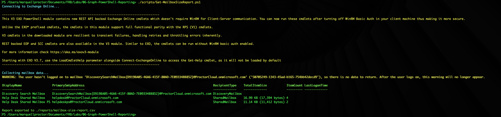
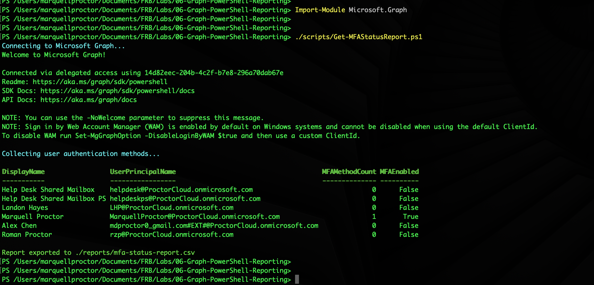

# Lab 06 — Graph API & Bulk PowerShell Reporting

**Tenant:** ProctorCloud.onmicrosoft.com  
**Date Completed:** June 1, 2026  
**Tools:** Exchange Online PowerShell (`ExchangeOnlineManagement`) · Microsoft Graph PowerShell SDK (`Microsoft.Graph`)

---

## Objective

Demonstrate automation-first administration — the ability to extract actionable operational intelligence across an M365 tenant without clicking through portals. Both scripts solve real production problems: mailbox size reporting for capacity planning and license management, and MFA status reporting for security posture and compliance auditing. Both export to CSV for downstream reporting, ticketing, or executive dashboards.

---

## Scripts

| Script | Module | Use Case |
|--------|--------|----------|
| [`Get-MailboxSizeReport.ps1`](./scripts/Get-MailboxSizeReport.ps1) | ExchangeOnlineManagement | Inventory all mailboxes — size, item count, last logon, recipient type |
| [`Get-MFAStatusReport.ps1`](./scripts/Get-MFAStatusReport.ps1) | Microsoft.Graph | Audit MFA enrollment status across all users via Graph API |

---

## Script 1 — Mailbox Size Report

### What it does
Connects to Exchange Online, iterates every mailbox regardless of type, pulls size and activity statistics, and exports a structured CSV report. Covers all recipient types — user mailboxes, shared mailboxes, discovery mailboxes — in a single run.

### Output fields

| Field | Source | Value |
|-------|--------|-------|
| DisplayName | Get-Mailbox | Friendly name |
| PrimarySmtpAddress | Get-Mailbox | Email address |
| RecipientType | Get-Mailbox | UserMailbox / SharedMailbox / DiscoveryMailbox |
| TotalItemSize | Get-MailboxStatistics | Storage consumed |
| ItemCount | Get-MailboxStatistics | Number of items |
| LastLogonTime | Get-MailboxStatistics | Last user activity |

### Terminal output


**Results:**
- Discovery Search Mailbox — DiscoveryMailbox (no data — expected, never logged into)
- Help Desk Shared Mailbox — SharedMailbox — 16.99 KB / 4 items
- Help Desk Shared Mailbox PS — SharedMailbox — 11.14 KB / 2 items

**Warning noted and documented:** The Discovery Search Mailbox generates a warning that it has never been logged into — this is expected behavior for system mailboxes. The script handles this gracefully and continues processing remaining mailboxes.

### Production use cases
- **Capacity planning** — identify mailboxes approaching quota limits before users hit them
- **License optimization** — shared mailboxes over 50 GB require a license; identify candidates
- **Inactive mailbox detection** — LastLogonTime identifies accounts with no recent activity for review or offboarding
- **Audit reporting** — point-in-time snapshot of all mailbox sizes for compliance records

---

## Script 2 — MFA Status Report

### What it does
Connects to Microsoft Graph with delegated permissions, retrieves all users and their registered authentication methods, identifies whether each user has enrolled any MFA method beyond password, and exports a per-user MFA status report to CSV.

### Permissions required
```
UserAuthenticationMethod.Read.All
User.Read.All
```

### Output fields

| Field | Source | Value |
|-------|--------|-------|
| DisplayName | Get-MgUser | Friendly name |
| UserPrincipalName | Get-MgUser | UPN |
| MFAMethodCount | Get-MgUserAuthenticationMethod | Count of non-password auth methods |
| MFAEnabled | Calculated | True if MFAMethodCount > 0 |

### Terminal output


**Results — 6 users audited:**

| User | MFAMethodCount | MFAEnabled |
|------|---------------|------------|
| Help Desk Shared Mailbox | 0 | False |
| Help Desk Shared Mailbox PS | 0 | False |
| Landon Hayes | 0 | False |
| Marquell Proctor | 1 | **True** |
| Alex Chen | 0 | False |
| Roman Proctor | 0 | False |

**Security finding: 5 of 6 accounts have no MFA method enrolled.** In a production environment this report would immediately generate remediation tickets. This is exactly the actionable output this script is designed to surface — you can't fix what you can't see.

> Shared mailboxes (Help Desk) correctly show MFAEnabled: False. Shared mailboxes don't support interactive sign-in and don't require MFA enrollment — they authenticate via delegation from licensed users. The script correctly captures this and it should be filtered out in production reporting to avoid false positives.

### Production use cases
- **Security posture baseline** — instant org-wide MFA enrollment snapshot
- **Compliance reporting** — evidence of MFA coverage for auditors
- **Remediation targeting** — export to CSV, import to ticketing system, assign MFA enrollment tasks to managers
- **Conditional Access validation** — verify MFA coverage before enforcing CA policies that require MFA

---

## Why Graph API vs Exchange Online PowerShell

| | Exchange Online PowerShell | Microsoft Graph PowerShell |
|--|--------------------------|--------------------------|
| Best for | Mailbox/mail flow operations | User, identity, auth, cross-workload |
| Authentication data | Not available | Full auth method details |
| Scope | Exchange workload | All M365 workloads |
| Modern auth | Yes (V3 module) | Yes (delegated + app-only) |
| Use together | ✅ | ✅ |

> These two modules are complementary, not competing. Exchange Online PowerShell owns mailbox operations. Graph owns identity, authentication, and cross-workload reporting. A complete M365 automation toolkit uses both.

---

## Key Concepts Demonstrated

| Concept | Applied Here |
|---------|-------------|
| Automation-first mindset | Both tasks scripted as `.ps1` files — not manual portal clicks |
| Exchange Online PowerShell V3 | REST API-backed module, no WinRM dependency |
| Microsoft Graph PowerShell SDK | Delegated access, scoped permissions, modern auth |
| `[PSCustomObject]` output | Structured objects enable pipeline, Format-Table, and Export-Csv |
| Export-Csv reporting | Machine-readable output for downstream systems |
| Real security finding surfaced | MFA report immediately identifies 5 unenrolled accounts |
| Shared mailbox MFA caveat | Correctly identified and documented to avoid false positives |
| Script organization | Scripts in `/scripts` subdirectory — production-ready structure |
