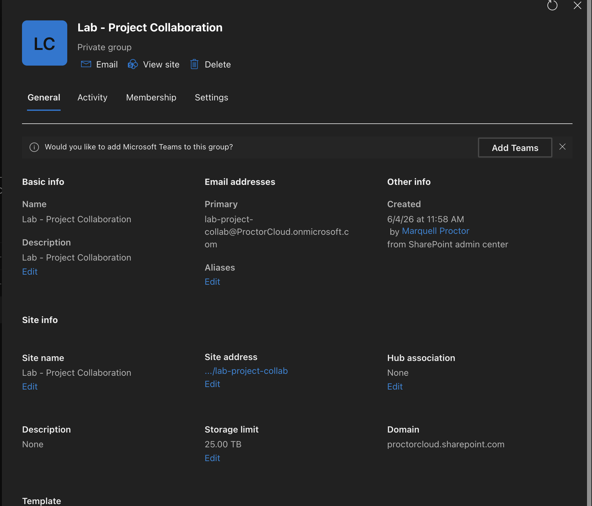
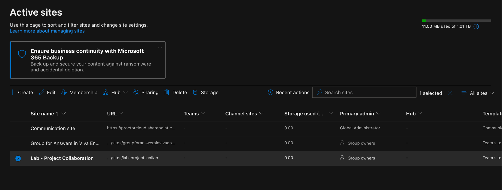
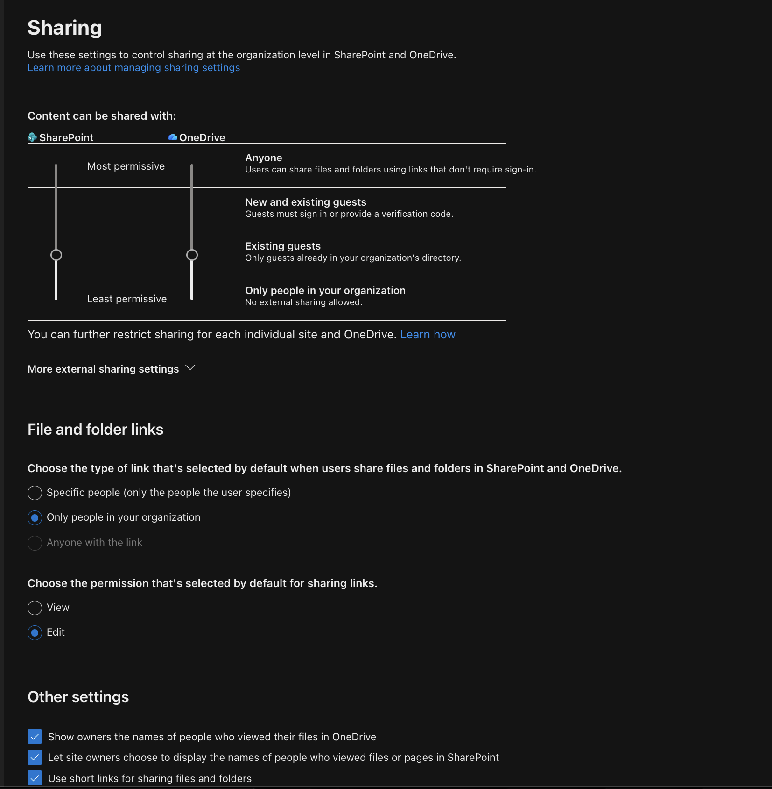
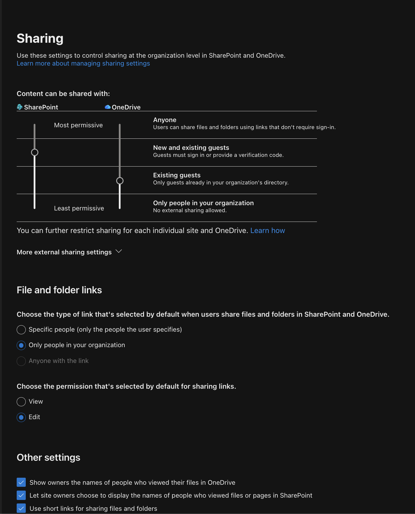
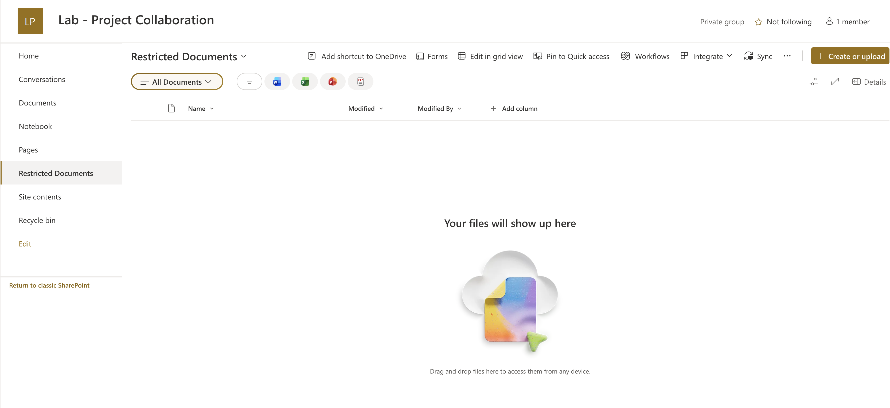
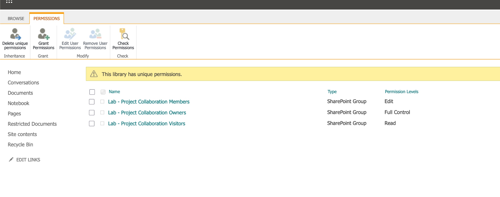
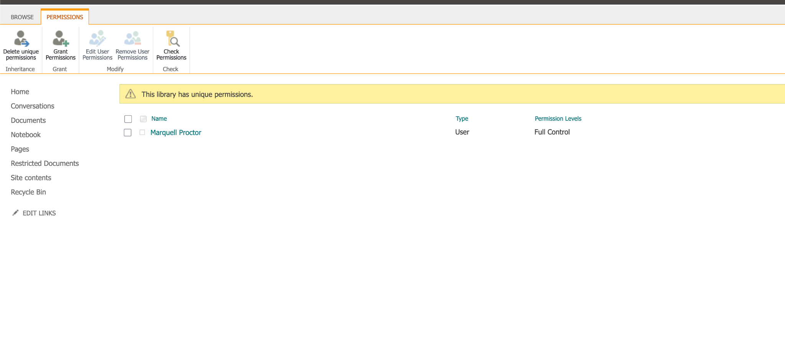
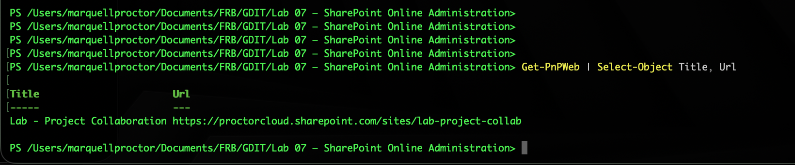
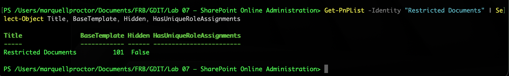
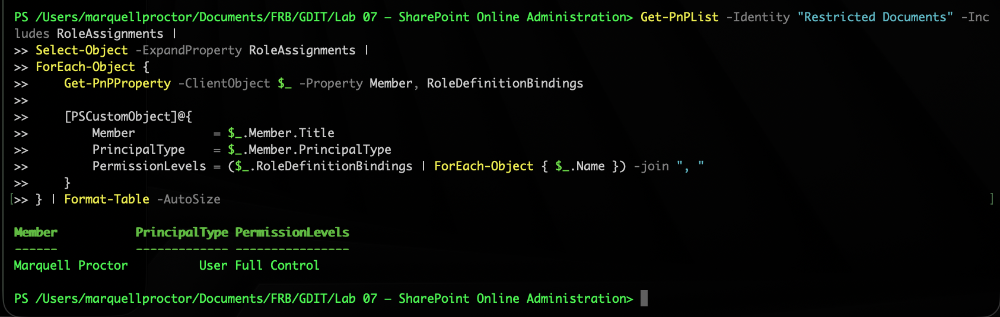

# Lab 07 — SharePoint Online Administration

**Tenant:** ProctorCloud.onmicrosoft.com  
**Date Completed:** June 4, 2026  
**Tools:** SharePoint Admin Center · SharePoint Site Settings · PnP PowerShell (`PnP.PowerShell`)

---

## Objective

Configure and secure a SharePoint Online Team Site — demonstrating site creation, org-level sharing governance, document library permission management, and PowerShell-based administration using PnP PowerShell. SharePoint Online is explicitly required in both target roles and is the primary collaboration and document management platform in M365 environments.

---

## What Was Built

### 1. Team Site — Lab - Project Collaboration

A private SharePoint Team Site created from the SharePoint Admin Center.

**Configuration:**
- Name: Lab - Project Collaboration
- Site address: `.../sites/lab-project-collab`
- Privacy: Private group — only members can access
- Template: Team site
- Primary admin: Marquell Proctor
- Associated M365 group created automatically




> A Team site automatically creates an associated Microsoft 365 group, a Teams-connectable workspace, a SharePoint document library, and a shared mailbox. This is the standard collaboration site type for project teams. A Communication site is used for broadcast content — news, announcements — where a small number of authors publish to a large audience.

---

### 2. External Sharing Settings — Org-Level Governance

**SharePoint Admin Center → Policies → Sharing**

The four sharing levels from most to least permissive:

| Level | Behavior |
|-------|---------|
| Anyone | Share files with links requiring no sign-in — anonymous access |
| New and existing guests | Guests must sign in or provide a verification code |
| Existing guests | Only guests already in your organization's directory |
| Only people in your organization | No external sharing — most restrictive |

**Before:** Both SharePoint and OneDrive set to Existing guests  
**After:** SharePoint moved to New and existing guests — OneDrive remains at Existing guests




> Org-level sharing settings act as a ceiling — individual sites can be more restrictive but never more permissive than the org setting. In a regulated environment like federal government you'd typically set this to Existing guests or Only people in your organization, with any exceptions requiring a formal approval process.

---

### 3. Document Library — Restricted Documents with Unique Permissions

A document library with permissions broken from the parent site and restricted to a single user.

**Library name:** Restricted Documents  
**Permission model:** Unique permissions — inheritance stopped

**Why stopping inheritance alone is not enough:**

When you stop inheriting permissions SharePoint copies the existing permissions as a starting point — it does not wipe them. After stopping inheritance the library still had three SharePoint groups with access:

| Group | Permission Level |
|-------|----------------|
| Lab - Project Collaboration Members | Edit |
| Lab - Project Collaboration Owners | Full Control |
| Lab - Project Collaboration Visitors | Read |

All three were removed. Only the admin account was added back with Full Control.

**Final permission state:** Marquell Proctor — User — Full Control only





> This is the correct least-privilege approach. Breaking inheritance without removing the copied groups gives a false sense of security — the groups still have access, just locally managed now instead of inherited. True least privilege requires removing everything and adding back only what's explicitly needed.

---

## PowerShell — PnP PowerShell

PnP PowerShell is the standard module for SharePoint Online administration via command line. It provides cmdlets for site management, list/library operations, permissions, and content management.

### Connect to SharePoint site
```powershell
Connect-PnPOnline -Url "https://proctorcloud.sharepoint.com/sites/lab-project-collab" `
  -UseWebLogin
```

### Verify site connection
```powershell
Get-PnPWeb | Select-Object Title, Url
```

**Output:**
- Title: Lab - Project Collaboration
- URL: https://proctorcloud.sharepoint.com/sites/lab-project-collab



### Verify document library and unique permissions flag
```powershell
Get-PnPList -Identity "Restricted Documents" | `
  Select-Object Title, BaseTemplate, Hidden, HasUniqueRoleAssignments
```

**Output confirms:**
- Title: Restricted Documents
- BaseTemplate: 101 (standard document library)
- HasUniqueRoleAssignments: True — unique permissions confirmed



### Generate permissions report
```powershell
Get-PnPList -Identity "Restricted Documents" -Includes RoleAssignments |
  Select-Object -ExpandProperty RoleAssignments |
  ForEach-Object {
    Get-PnPProperty -ClientObject $_ -Property Member, RoleDefinitionBindings
    [PSCustomObject]@{
      Member           = $_.Member.Title
      PrincipalType    = $_.Member.PrincipalType
      PermissionLevels = ($_.RoleDefinitionBindings | ForEach-Object { $_.Name }) -join ", "
    }
  } | Format-Table -AutoSize
```

**Output confirms:**
- Member: Marquell Proctor
- PrincipalType: User
- PermissionLevels: Full Control

Only one principal with access — least privilege enforced and verified via PowerShell.



---

## SharePoint Permission Levels Reference

| Permission Level | What It Allows |
|-----------------|----------------|
| Full Control | All permissions — manage site, permissions, content |
| Design | Edit pages, apply themes, manage lists |
| Edit | Add, edit, delete lists and list items |
| Contribute | Add, edit, delete list items only |
| Read | View only — no changes |
| View Only | View without download |

---

## Key Concepts Demonstrated

| Concept | Applied Here |
|---------|-------------|
| Team site vs Communication site | Team site for collaboration, M365 group attached automatically |
| Org-level sharing tiers | Four levels from Anyone to Only your org — acts as ceiling for all sites |
| Unique permissions | Inheritance stopped — library permissions managed independently from site |
| Stop inheritance ≠ least privilege | Copying permissions is not wiping them — must explicitly remove unwanted groups |
| PnP PowerShell | Connect-PnPOnline, Get-PnPWeb, Get-PnPList, permissions reporting |
| HasUniqueRoleAssignments | PowerShell property confirming unique permissions are active |
| Permissions report via PowerShell | RoleAssignments + RoleDefinitionBindings — full audit of who has what access |
